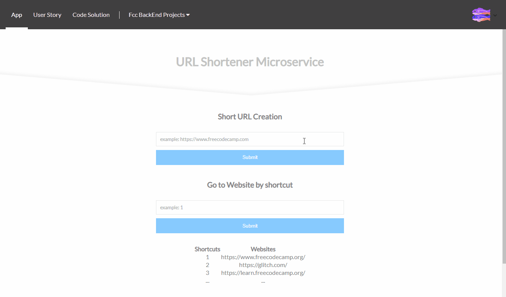

# API Project: URL Shortener Microservice for freeCodeCamp
### About the project

it's a freecodecamp project in the "Apis and Microservices Projects" module, you have to build an API that will receive a URL and return a json response containing a shortcut for that URL.

bonus*: 
- Front-end using React, Sass, Responsive Design

### Tools used

**Front-end:** React

**Back-end:** Express, mongodb, mongoose

### Screenshot

### Link

https://fcc-bt-url-shortener.glitch.me

### User stories

1. I can POST a URL to `[project_url]/api/shorturl/new` and I will receive a shortened URL in the JSON response. Example : `{"original_url":"www.google.com","short_url":1}`
2. If I pass an invalid URL that doesn't follow the valid `http(s)://www.example.com(/more/routes)` format, the JSON response will contain an error like `{"error":"invalid URL"}`. *HINT*: to be sure that the submitted url points to a valid site you can use the function `dns.lookup(host, cb)` from the `dns` core module.
3. When I visit the shortened URL, it will redirect me to my original link.
